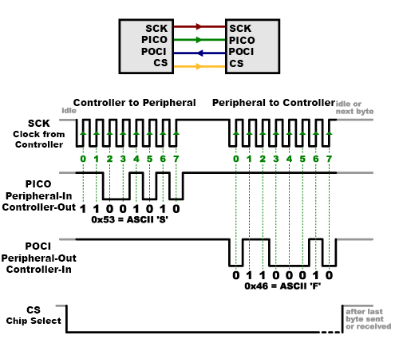
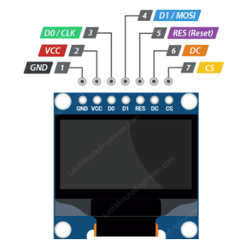

- Master-Slave架構, 按照時鐘訊號進行數據傳輸
  

## pin define
- SCLK（Serial Clock）
- Master Out Slave In
- Master In Slave Out
- Chip Select

## set mode
- CPOL (Clock POLarity) = 時脈極性
- CPHA (Clock PHAse) = 時脈相位

## 實作SSD1306 SPI OLED

| SSD1306 模組腳位 | NUCLEO-F413ZH 腳位 | 說明 |
| :--- | :--- | :--- |
| **GND** | GND | 接地 |
| **VCC** | 3.3V | (模組通常亦支援 5V) |
| **D0 / CLK** | **PA5** | SPI1_SCK (時脈) |
| **D1 / MOSI** | **PA7** | SPI1_MOSI (數據輸入) |
| **(無)** | (PA6 不接) | MISO (OLED 不需要回傳資料) |
| **RST / RES** | **PD13** (原 PA2) | 重置腳 (Reset)，低電位觸發 |
| **DC / D/C** | **PD12** (原 PA3) | 資料/命令控制 (High=Data, Low=Cmd) |
| **CS** | **PD11** (原 PA4) | 片選 (Chip Select)，通常用軟體 GPIO 控制 |

NOTE: 
- monitor MISO不用接線
- 若用 SSD1306：還要把 PA8、PA9、PA10 設為 GPIO Output

## main.c code

[code](https://docs.google.com/document/d/1KG6kNhx2QkprnHGAG-daJfsLNkS1Rvmz_NlVRcDmKYw/edit?tab=t.0)

- hello
- SPI OLED

